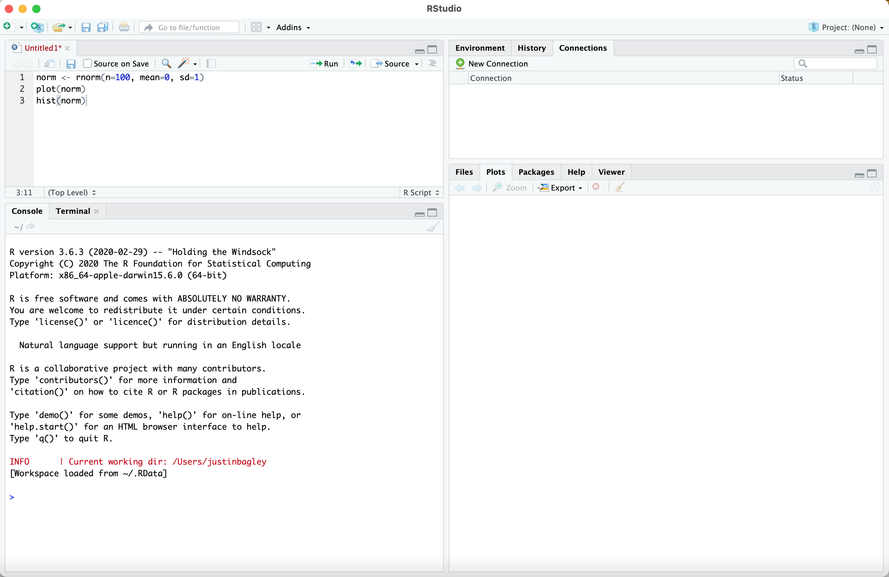

# Practical "00": Introduction to `R`

Justin C. Bagley, Ph.D.

_Jacksonville State University_ (JSU)

_Last update:_ 19 August 2021

During Ecology Laboratory, we will walk through all of the main steps in using ecological niche modeling (ENM) to better understand the potential past, present, or future distributions of suitable habitat (niche conditions) for species (e.g., Elith et al., 2006; Peterson et al., 2011). Prior to getting into ENM and related analyses in detail, this first practical (equivalent to a computer/research exercise), Practical "00," is designed to give  you a chance to familiarize yourself with `R` (R Core Team 2020), the statistical computing environment that we will use for most of our ENM research.

<!-- Some of our ENM laboratory practicals are modified directly from content written by Dr. Adam B. Smith (The Global Change Conservation Lab, Missouri Botanical Garden) for his workshop entitled, "Best Practices in Species Distribution Modeling: A Workshop in R," for which the original materials including copies of workshop exercises and data can be found at [Earth::Sky::Sea (www.EarthSkySea.org)](http://www.earthskysea.org/workshops-classes/). Feel free to download the associated compressed '.zip' archive to peruse Dr. Smith’s original workshop materials and compare them to the materials developed here for BY 332 at JSU. Additional code has been modified from code made available by Dr. Xiao Feng during a recent NIMBios Workshop (link).

...but not anything from the present Practical "00."
-->

---

## CONTENTS

1. [R](#1-r)
 - 1.1. [Installation](#1-1-installation)
 - 1.2. [R Editor](#1-2-r-editor)
2. [R Basics](#2-r-basics)
 - 2.1. [Language, Data Structures, and Basic Operations](#21-language-data-structures-and-basic-operations)
 - 2.2. [Setting the Working Directory](#22-setting-the-working-directory)
 - 2.3. [Packages](#23-packages)
 - 2.4. [Help](#24-help)
3. [Going Deeper](#3-going-deeper)
 - 3.1. More On Input and output
     - 3.1.1. Reading in Data
     - 3.1.2. Entering Data Manually and Plotting It
     - 3.1.3. A Longer Input/Output Example
 - 3.2. [Printing](#32-printing)
 - 3.3. [Checking and Cleaning Your Environment](#33-checking-and-cleaning-your-environment)
 - 3.4. [Even More On Plotting Data](#34-even-more-on-plotting-data)
 4. [Final Take-home Messages / Tips](#4-final-take-home-messages-tips)
 5. [References](#5-references)

---

<!-- ADD R LOGO IMAGE HERE -->

<!-- ") -->

<a href="https://www.r-project.org/logo/Rlogo.png"></a>

## 1. R

`R` is a powerful statistical computing environment for managing data, conducting statistical analyses, graphics, simulations, and computer programing that is used by more than 2 million people around the world every day. `R` is among the most popular programming applications in Data Science, and with more than 12,000<sup>+</sup> available in-house or third-party "packages" (add-on software) `R` and its capabilities have superseded most other commercial software packages available on the market today.

### 1.1. Installation

For the purposes of our course, your Instructor has already installed `R` version 3.6.3. (v3.6.3.), and most or all of the packages that will be required for conducting our research projects, on a series of Windows 10 machines in the computer lab in MAH 203 (on the JSU campus), which are available to you. Also on these machines, you can see that you already have Microsoft Office and other common programs that you will need to interact with during labs.

> **IMPORTANT!**
>
> This means that you DO NOT need to install `R` now on MAH 203 machines!

However, if you would like to download `R` onto your personal laptop or desktop machine (which for most users will be either Windows 9/10 or macOS 10+ machines) to facilitate self-study and research outside of lab hours, then you may do so by downloading the appropriate `R` installer for your machine from the [`R` Project website](https://www.r-project.org/). The current version of `R` is v4.1.1. as of this writing.

Be sure to match the power of your processor (e.g., either newer and faster 64-bit processors, versus older and slower 32-bit processors) to the version of the `R` installer you choose. You may alternatively wish to install `r-base` using a `conda` / Anaconda distribution of Python, if you have one of those installed and running on your machine (e.g., indicated by "(base)" in your command line prompt and if `conda list` returns a list of `conda` packages). See the [Anaconda website](https://www.anaconda.com/), [this Anaconda `R` page](https://docs.anaconda.com/anaconda/user-guide/tasks/using-r-language/), and [this Biostars thread](https://www.biostars.org/p/450316/) for more details.

### 1.2. R Editor

As you get started in `R`, your first task after installation is to open `R`. You will do this by typing "`R`" at the command line or double-clicking on the R v3.6.3. icon in the windows Start screen or Desktop. For this course, we can try different options; however, the default `R` console can be intimidating. So, I recommend that you use an `R` editor, or integrated deveopment environment (IDE), to improve your user experience and make organizing and running code, checking data, querying help resources, and visualizing and saving graphics all _much_ easier. The best `R` editor available on the market is [RStudio](https://www.rstudio.com), which you can download from [https://www.rstudio.com](https://www.rstudio.com).

Features that the standard `R` console and `RStudio` have in common include tab completion of paths, filenames, commands, and package names, as well as the ability to use multiple windows for displaying graphical output. Both are also stopped by similar keyboard shortcuts, including "Esc" / "Escape" and "Ctrl + C" (on Windows), and "Command + C" (on macOS).

The regular `R` console is best used in conjunction with at least a text editor (e.g. Atom, TextWrangler, or BBEdit) to prepare your code before pasting in and running it in the `R` console. There are two reasons for this: (1) commands typed into the console are not saved, and (2) you will want to save your code in a shareable/editable file for storage and later use.

However, `RStudio` has a more complex but user-friendly interface with multiple different windows (**Fig. 1**) for:

1. prepping code (script window at top left),
2. running code (console window at bottom left),
3. capabilities related to viewing packages loaded in the environment and previously run code ("Environment / History / Connection" window at top right), and
4. viewing data or file contents and saving graphical output ("Files / Plots / Packages / Help / Viewer" window at bottom right).

These additional levels of organization help bring order to the chaos of running `R`.

Here is an image showing what your instructor's version of `RStudio` looks like, right after opening the program in default display mode on macOS:

<!-- ") -->


<!-- https://github.com/justincbagley/ENM-CURE/blob/main/assets/RStudio_help_rnorm.png-->

**Figure 1.**

Alternatively, here is an image (**Fig. 2**) of the most recent version of `RStudio` running in dark mode and showing all four of the above windows:

<a href="https://d33wubrfki0l68.cloudfront.net/5fd4d2ed807d104244dd297c44f458a12b227ad7/6090c/2021/01/19/announcing-rstudio-1-4/rstudio-1.4_hu535661bce2c742bf7a0f6a055ac0b6d1_353478_960x0_resize_q75_box.jpg"></a>

**Figure 2.**

---

## 2. R Basics


### 2.1. Language, Data Structures, and Basic Operations

##### _R Language_

`R` is both a programming language and statistical computing environment and was developed in the mid-1990's based on the `S` computer language (Ihaka and Gentleman 1996). This makes `R` both difficult to use, at first, but also very powerful and flexible.

##### _Basic Approach / Programming_

For starters, we code in `R` by entering commands at the `R` prompt, "`>`". Any line that starts with a pound symbol ("#") is commented out and will be skipped by the program; this is handy because adding comments to your code makes it more readable and useful. For example, if you need to edit code you were working on developing two weeks ago, or you want to come back to more developed code from an analysis you did for a paper 1-2 years ago; my mantra: "Your best collaborator is you 9 months ago." - paraphrasing U. Kentucky professor [Dr. Mark Holder](https://eeb.ku.edu/mark-t-holder). Conversely, `R` will attempt to run as code any text that is _not_ commented out, so if you accidentally forget to silence an actual comment by placing "#" at the front of the line, then `R` will throw an error because it cannot do anything with just text.

##### _Objects and Functions_

There are many other basic conventions, including that `R` stores data into **'objects'** that have names and which are stored in the computer's memory ([RAM](https://en.wikipedia.org/wiki/Random-access_memory)). This means that data and results of analyses that are stored in objects can easily be analyzed with `R` **functions**. This is very powerful because data can be analyzed through various series of commands (e.g. loops, or functions from different packages) and changed into different objects along the way. For example, it is very easy to summarize a vector of integers or data in tabular format that are saved into an object using the `table()` or `summary()` functions. Importantly, by convention, the names of `R` objects must start with a letter, "A-Z "or "a-z", and not a number, and may also contain underscore ("_"), dot ("."), and numeric ("0-9") characters.

`R` **functions** are computer code or `R` programs that perform a specific task. `R` functions, like objects, always have names. So, how can we tell functions from objects? If you type the name of an object, its contents are displayed or summarized. If you type the name of an `R` function, the contents (e.g. code) of the function will be displayed. So, by common convention, functions are written followed by parentheses (e.g. `summary()`) and objects (e.g. `x`) are written without them.

##### _Basic Data Storage and Plotting_

How are data stored in objects? This can be done various ways, the most common of which is to assign data to an object using the "assign" symbol, "`<-`" (an 'arrow' made up of the less than and dash symbols), which may point either left or right. One canonical example of creating an `R` object is:

<!-- :computer:-->
```python
norm <- rnorm(n=100, mean=0, sd=1)
plot(norm)
hist(norm)
```

<!--This is what it looks like:-->


**Figure 3**

The first line of this code uses the `rnorm` function in `R` to create a random normal distribution made up of 100 data points, with a mean of zero and a standard deviation of 1. The second line plots the raw values saved in this object, `norm`. The third line plots a simple histogram of the distribution (**Fig. 3**), which is a plot of the frequency of each observation, divided into a set of bins (10 bins by default; this number can be changed to n+1 bins by setting `breaks=n`).


##### _R Data Types_

`R` supports a wide variety of data structures and types, including **scalar**, **vector**, **matrix**, **data frame**, and **list** data types.

**Vectors** are strings of data. Additionally, vectors may be numerical, character, or logical in **mode**. We _make_ vectors using the `c()` function. Canonical examples (from [here](https://www.statmethods.net/input/datatypes.html)) include:

<!-- :computer:-->
```python
a <- c(1,2,5.3,6,-2,4) # numeric vector
b <- c("one","two","three") # character vector
c <- c(TRUE,TRUE,TRUE,FALSE,TRUE,FALSE) # logical vector
```

For each data type, elements of a given data object are indexed using square brackets with or without subscripts. <!-- By convention, elements of vectors and lists are accessed by one number or range in square brackets. On the other hand, elements of matrices and data frames refer to ... -->
By convention, wherever possible, e.g. when working with **data frames and matrices**, subscripts are ordered as "[row, col]", so that for example `x[1,]` calls the first row of a data frame or matrix, `x[,4]` calls the fourth column of a data frame or matrix, and `x[1,4]` calls the value in the cell at the first row and fourth column of a data frame or matrix.

How do **matrices** differ from **data frames**? Well, all columns in a matrix must be of identical mode and length. By contrast, in data frames, different columns can have different modes. This is also true of lists: list elements may have different modes. So, remember:

> **Key Message:**
>
> Data frames and lists are the only R data types that can have different modes. Other types, including scalars, vectors, and matrices, must have all elements of the same mode!

### 2.2. Setting the Working Directory

It is important that the `R` workspace is set up correctly before starting working with `R`. The first order of business is usually to point `R` to the correct working directory.

We set the working directory using the `setwd()` function. This tells `R` which folder of our computer to read from or write to and it works in any `R` implementation. In `RStudio`, you don't have to use the `setwd()` function; instead, you can easily set the working directory by clicking "Set Working Directory" under the "Session" drop-down menu.

### 2.3. Packages

`R` **packages** are sets of functions, documentation, and data. These are so important that Hadley Wickham has called packages "the fundamental units of reproducible R code" ([ref](https://r-pkgs.org/index.html)). `R` packages are stored in a directory called 'library' and so each one is loaded as a **library** (because packages are not just _one_ thing) using the `library()` function in `R`.

Packages may generally be installed using the `install.packages()` function (**Fig. 4**). Additionally, it is a good idea to point `R` to the repository that the package will be installed from using the `repos` argument. My preferred settings for the `repos` argument are as follows: (1) `repos='http://cran.us.r-project.org'` (most common, works for the most packages) which pulls from [CRAN](http://cran.us.r-project.org), The **C**omprehensive **R** **A**rchive **N**etwork, or (2) [R-Forge](http://R-Forge.R-project.org) `repos='http://R-Forge.R-project.org'` (works for packages on R-Forge).

Here is an example of installing a package in `R` using `install.packages()` and then loading the program with `library()`:


**Figure 4.**

Sometimes `devtools` or other specialized packages (e.g. `remotes`) must be installed and loaded first before installing a given `R` package.

### 2.4. Help

One of the best parts of using `R`, in general, is its overall good documentation, as well as intuitive and easy way that you can access help documents from the console. In `R` or `RStudio`, you can get help on packages and functions using the `help()` command, e.g. as in `help(rnorm)`, or simply by placing the `?` symbol before the name of the function/package. Try this yourself by typing `?rnorm` at the command prompt in `R` (as in **Fig. 5** below). You can obtain more general helpful information by using a double-question-mark symbol, `??` before a package or function, as in `??summary`.


**Figure 5.**

---

## 3. Going Deeper

### 3.1. More On Input and Output

#### 3.1.1. Reading in Data

Many data sets worldwide are available in tabular format, such as spreadsheets or comma-separated value (.csv) files. It is very easy to read .csv files into `R`, for example using the `read.table()` and `read.csv()` functions. An example of the basic process would be:

<!-- :computer:-->
```python
data <- read.table(file='./data.csv', header=TRUE, sep=',')
```

This `read.table()` example is a little longer than that for `read.csv()`, which for the same file would be as follows:

<!-- :computer:-->
```python
data <- read.csv(file='./data.csv')
```

Using the `read.table()` approach also works for other data formats, only requiring that the basic arguments are passed, including `sep` argument, which tells `R` what character is used to separate columns in your data. For example, you could use `read.table()` to read in a tab-separated value (.tsv, or .txt extension) data file with:

<!-- :computer:-->
```python
data <- read.table(file='./data.tsv', header=TRUE, sep='\t')
```

...where `sep='\t'` means the tab character separates the columns (specifically, we are setting the `sep` argument to the tab character).

#### 3.1.2. Entering Data Manually and Plotting It

You can make your own vector of data when you have a very small dataset, for example

<!-- :computer:-->
```python
data <- c(27.8, 30.1, 26.9, 27.1, 29.3)
```

This is easy and doesn't take much time to do by hand; it will become second nature. You can also quickly create your own data frame by hand, for example (adapted from Teetor 2011, p. 72):

<!-- :computer:-->
```python
points <- data.frame(
      label=c('low','mid','high'),
      lbound=c(0, 0.67, 1.64),
      ubound=c(0.674, 1.64, 2.33)
)
```

Here, you have just input a data frame containing three rows of data, one for each of the low, middle, and high values of the data. The data are for two variables, the lower bound ("lbound") and upper bound ("ubound") of some parameter estimates. Each string defined using the concatenation command `c()` is added as a column. The resulting "label" column gives a set of factors indicating the low, middle, and high values, with factor names "low", "mid", and "high." This example illustrates how to use the `data.frame()` function, and how this function does not require any other arguments to generate the data frame, so long as the elements are all of the same length (i.e., result in columns with the same number of rows).

Data with complex dynamics can also easily be generated and plotted. For example, here is an example (**Fig. 6**; from [here](https://github.com/Robinlovelace/Creating-maps-in-R)) showing dampening oscillations:

<!-- :computer:-->
```python
# Generate data
x <- 1:400
y <- sin(x / 10) * exp(x * -0.01)

plot(x, y) # plot the result
```

<!--This is what it looks like:-->


**Figure 6.**

#### 3.1.3. A Longer Input/Output Example

##### _Exploring Vectors, Matrices, and Plotting with Number Sequences_

A cool way to make a matrix is to make vectors, then make an empty matrix and fill it with the vectors as columns. We can learn a few things by doing this in `R` while playing around with popular **number sequences**, including
the **Fibonacci sequence** (sequence characterized by the next number being the sum of the previous two numbers starting from 0 and 1; an important sequence in mathematics that is suprisingly common in biological systems)
and the **'Angel numbers'** (each number adding an additional numeral; in our case, we will look at a series adding an additional '9'; this and related sequences are a silly fascination from numerology). First, we will input these number sequences manually and then graphically evaluate
them by plotting them. Then we will make a matrix containing the
data we come up with.

This exercise will introduce you to a variety of common tasks in `R`, including concatenation (`c()`), plotting (`plot()`, and `pch` argument), adding lines to a plot (`lines()`), using `R` to create sequences (`seq()`), creating custom plot windows (`par(mfrow=c(r,c))`), creating matrices (`matrix()`) and converting a matrix to a data frame (`as.data.frame()`). See below.

<!-- :computer:-->
```python
# The first ten Fibonacci numbers, saved to object named 'Fib'.
Fib <- c(0, 1, 1, 2, 3, 5, 8, 13, 21, 34)
# The first ten Angel 9 numbers.
Angel9 <- c(9, 99, 999, 9999, 99999, 999999, 9999999, 99999999, 999999999, 9999999999)

# Plot Fibonacci sequence vs. Angel 9 sequence:
plot(Fib ~ Angel9)

# Change the plot to make the data points black circles and add a line to the graph
# connecting the points.
plot(Fib ~ Angel9, pch=19)
lines(Fib ~ Angel9)

# Make a vector containing the index numbers 1-10:
i <- c(1, 2, 3, 4, 5, 6, 7, 8, 9, 10)
i
# RESULT:
# [1]  1  2  3  4  5  6  7  8  9 10

# Although it only takes a few seconds to do this, it is faster to do it with the
# 'seq()' function:
i <- seq(from=1, to=10)
i
# RESULT:
# [1]  1  2  3  4  5  6  7  8  9 10

# Now plot the Fibonacci sequence vs. the index:
plot(Fib ~ i, pch=19)
lines(Fib ~ i)

# For comparative purposes, here is an exponential growth/incr. equation (with an
# arbitrary constant and y coerced to 0 when x=1), also starting at 0 and ending
# at 34 in 10 steps (just like the Fibonacci sequence):
exp <- c(0, 0.66781584, 1.091478209, 1.783911985, 2.915625748, 4.765298722, 7.788404231, 12.72936788, 20.80487886, 34.003494)
exp

par(mfrow=c(1,3))
plot(Fib ~ i, pch=19, col='black', main='Fibonacci')
lines(Fib ~ i)
plot(exp ~ i, pch=19, col='blue', main='Exponential')
lines(exp ~ i, col='blue')
plot(Fib ~ exp, col='gray50', pch=19, main='Comparison')
lines(x=seq(1,34), y=seq(1,34))

# Note: we can make the exponential vector in R if we know the equation, as in:
y <- 0.25*(1.634^(i))
# Then coerce value to y=0 when x=1 with:
y[1] <- 0
y
# RESULT:
# [1]  0.000000  0.667489  1.090677  1.782166  2.912060  4.758306  7.775071
# [8] 12.704466 20.759098 33.920366

# Back to matrices...

# Make a matrix to hold our number sequence data generated and plotted above. This
# matrix will need to have 10 rows to match our index and number of elements in
# each sequence. It will also need to have 4 columns: one for the index (i), one for
# the Fibonacci numbers (Fib), one for the Angel 9 numbers, and one for the exponential
# growth numbers (exp).
mat <- matrix(nrow=10, ncol=4)
mat[,1] <- i
mat[,2] <- Fib
mat[,3] <- Angel9
mat[,4] <- exp
# mat
colnames(mat) <- c('i','Fib','Angel9','exp')
# mat
row.names(mat) <- seq(1,10)
mat

# Now that we have a nice matrix, we can also convert it into a data frame using the
# 'as.data.frame()' function:
df <- as.data.frame(mat)
df
```

The above code will generate, among other things, the following 3-panel plot (**Fig. 7**) comparing the Fibonacci sequence to an exponential distribution:


**Figure 7.**

### 3.2. Printing

You can tell `R` to print the contents of an object or function by typing its name. For example,
we did this in the above number sequence examples when we typed just the names of the objects
`exp`, `y`, `mat`, and `df`. Remember, as noted above, typing the name of a function will print
the entire code within the function.

Additionally, we can make `R` print text to screen with the `print()` and `cat()` functions,
and this can be very useful when printing or saving the results of an analysis (more later). Indeed,
this is particularly useful when using these functions in conjunction with the `sink()` function,
which will allow us to redirect and capture all `R` output to file!

<!-- :computer:-->
```python
# From the comparison below, you will see that cat output is cleaner than that
# from print, because cat output does not have element numbers ("[1]"):
print('Hello world!')
cat('Hello world!', '\n')

# Here is a statistical test for normality of our exponential data from the previous
# section, using the Shapiro-Wilk test (shapiro.test() function). In this test, a significant p-value (p < 0.05)
# indicates that the data deviate from the assumption of normality.
shapiro.test(exp)
# RESULT:
#
#         Shapiro-Wilk normality test
#
# data:  exp
# W = 0.78878, p-value = 0.01059
#

# The above output is simply printed to the R console, but what if we wanted to
# save it to file? We can use sink() for this, by suppling the sink() function with an output filename, as follows:
sink('exp_shapiro_test_output.txt')
shapiro.test(exp)
sink()

# The second time that 'sink()' is called tells R to resume regular printing of
# output to the R console.
```

### 3.3. Checking and Cleaning Your Environment

In a typical R session, users will load multiple libraries and create a variety of
objects, or perhaps even hundreds or thousands of them! It is useful to briefly check to see what
objects are present in the environment while using `R`, and we can do this with the list function, 'ls()'.

To remove objects from your environment, use the `rm()` function (**BUT BE CAREFUL!**). One of the most powerful commands in `R` is when we use this function to remove _all objects_ from the current session, essentially wiping it clean. This command is `rm(list=ls())`, which tells `R` to remove all objects in a list created by `ls()`.

>**IMPORTANT!**
>
>(1) **In general, this is NOT a good idea, and you should have a healthy _fear_ of this procedure.**
>
>(2) **Additionally, `rm(list=ls())` is also NOT a nice line of code to include in example code or code for reproducible research**. Why? Because if someone accidentally runs it inside existing sessions/code, then it will delete everything. This may or may not lead to permanent data loss, depending on how their code is written and whether they saved their workspace previously or not.

### 3.4. Even More On Plotting Data

<!-- Once you read data into `R`, the next logical step is often to conduct exploratory statistical analyses, including basic graphical plotting, histograms, linear regressions (e.g. in biplots), etc. Luckily, plotting data is also very easy in `R` as you've already seen above! This section provides additional guidance on visualizing data with plotting functions.
-->

We have already used `R` in several contexts to read and plot data above. During this process, you may have noticed technical details of some of the plotting steps we did above using the `plot()` function. For example, in our [number sequences example](#313-a-longer-input-output-example) (section 3.1.3.), our first plots of the Fibonacci sequence had no plot title above the graph, because this was not specified. `R` can only do what you tell it to do!

There are two common ways of adding titles to graphs: (1) using the `main` argument of the `plot()` function, and (2) using the separate `title()` function.

Going back to our numbers example, the nicer three-column plots of Fibonacci and exponential data showed not only that the first 10 Fibonacci numbers are extremely close to an exponential function's values, but also that by adding `main` to each `plot()` call we could add a title to each subplot in the 3-panel graphic that resulted.

For the `title()` funtion, here is a canonical example with the `mtcars` dataset (**Fig. 8**; from [here](https://www.statmethods.net/r-tutorial/index.html)) that demonstrates that the process of creating graphs of data in `R` is interactive and stepwise and shows how to add a title with `title()`:

<!-- :computer:-->
```python
# Creating a Graph
attach(mtcars)
plot(wt, mpg)
abline(lm(mpg ~ wt))
title("Regression of MPG on Weight")
```


**Figure 8.**

## 4. Final Take-home Messages / Tips

The following list contains some pointers on basic `R` operations representing some of the take-home messages from this practical (and therefore, by nature, these points are redundant with the content above).

>**Remember...**
>
>-   ...the `R` console can be intimidating, so try `RStudio` instead (download [here](https://www.rstudio.com))!
>-   ...in order to access the functions within a package, you must first install the package (e.g. with `install.packages()`) and load it using the `library()` function.
>-   ...if you ever get stuck in `R`, you can easily access help documentation using `?` `??` or `help()`.
>-   ...`R` stores data as objects, and these may be scalars, vectors, matrices, data frames, or lists.
>-   ...the only data types for which mode (e.g. numerical, character, logical) can be different between elements/columns are data frames and lists!
>-   ...at the start of a session, set the working directory with the `setwd()` function.
>-   ...you can read in tabular data from files with `read.table()` and `read.csv()`.
>-   ...you can also enter data by hand by creating vectors with `c()`.
>-   ...the `plot()` function is king for basic data plotting and can be modified to make biplots, change symbols (`pch` arguments), or add a title to a plot (`main` argument).
>-   ...`par(mfrow=c(r,c))` allows creating multi-panel plots with specific numbers of rows (r) and columns (c).
>-   ...create matrices by hand with the `matrix()` command.
>-   ...convert matrices to data frame using the `as.data.frame()` function.
>-   ...the `sink()` function can help you save all text output to console to file, including the results of statistical tests.
>-   ...`rm()` is a powerful command for removing objects. DO NOT use it lightly. With great power comes great responsibility! Also be aware of it but DO NOT make regular use of `rm(list=ls())`.


## 5. References

- Elith, J., Graham, C.H., Anderson, R.P., Dudík, M., Ferrier, S., Guisan, A., Hijmans, R.J., Huettmann, F., Leathwick, J.R., Lehmann, A., Li, J., 2006. Novel methods improve prediction of species’ distributions from occurrence data. _Ecography_, 29(2), 129-151.
- Elith, J., Phillips, S.J., Hastie, T., Dudík, M., Chee, Y.E. and Yates, C.J., 2011. A statistical explanation of MaxEnt for ecologists. _Diversity and Distributions_, 17(1), 43–57.
- Ihaka, R., Gentleman, R., 1996. R: a language for data analysis and graphics. _Journal of Computational and Graphical Statistics_, 5(3), 299-314.
- Peterson, A.T., Soberón, J., Pearson, R.G., Anderson, R.P., Martínez-Meyer, E., Nakamura, M., Araújo, M.B., 2011. _Ecological Niches and Geographic Distributions_ (MPB-49). Princeton University Press.
<!-- Phillips, S.J., Anderson, R.P., Dudík, M., Schapire, R.E., Blair, M.E., 2017. Opening the black box: An open‐source release of Maxent. _Ecography_, 40(7), 887-893.-->
- R Core Team, 2020. R: A language and environment for statistical computing. R Foundation for Statistical Computing, Vienna, Austria. Available at: [https://www.R-project.org/](https://www.R-project.org/).
- Teetor, P., 2011. _R Cookbook: Proven Recipes for Data Analysis, Statistics, and Graphics_. O'Reilly Media, Inc: Cambridge.
